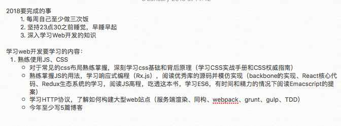
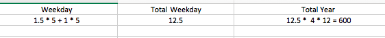

2018就这样过去了，从参加工作到现在，也工作也一年多了，现在自己也不再像刚毕业一样，在面对工作生活中的出现的一些麻烦问题慌张，不知所措，但是同时也要面对更复杂和麻烦的问题；2018年初的时候自己定过一些目标，虽然并没有100%都完成掉，但是主线都是在向这个目标靠近；在这一年里自己也有很多对工作、生活、学习的思考。
## 2018的目标完成了多少？

上图是当时在18年初定的目标，先说一说年初的时候为什么要定这些目标，第一个目标是每周做饭3次，这个当时主要是在工作后，一是觉得外卖难吃卫生情况很差，二是自己对做饭感兴趣，当时坚持过一段时间，周末基本上都会自己做一些吃的，但是每次开火做饭，后面切菜炒菜洗碗很费时间，后面就图方便自己做一些水果沙拉吃，基本上不吃外卖了，要么去店里吃，要么自己做一些沙拉吃；这个目标完成的其实不错。
第二个目标是当时的生活作息很差，晚上基本是都是1，2点睡，经常熬夜。对第二天影响很大，同时自己身体上也开始抗议，以前从来不长痘的，现在脸上也开始长痘，每天想23点30之前上床睡觉，其实对于现在来说挑战很大，基本上躺床上玩会儿手机，很快的就过了12点，在这一年里在睡觉前尽量把手机放在伸手拿不到的地方，玩手机的情况有很大改善。综合一年来平均来看，一般在晚上12点左右睡觉，平均睡眠时间在6个半小时左右；这里的话还是自己的自控力不好，但是看完《睡眠革命》之后，也改变了自己对睡眠的一些认识，这个在后面的文章会谈到。

第三个目标和工作息息相关，现在的工作集中在前端这块，项目组使用的前端技术栈是`React`，工作以后从事前端开发之后，才觉得以前对前端的认识实在太幼稚了，觉得前端不就是写写页面，没有什么技术含量，在学校的时候，很看不上前端，现在做了前端才发现，前端对于开发人员的学习能力、审美、沟通能力都有很高的要求，而且现在`Web`前端这块不再像我认识中的写写页面，更多的是在朝`Web App`发展，很多后端的业务逻辑放在了前端来做，前端这块承载的业务越来越重要。
`Jeff Atwood`是`StackOverflow`的创始人，在他的这篇博客[The Principle of Least Power](https://blog.codinghorror.com/the-principle-of-least-power/)中自己提出了了一个**Atwood's Law** —> `any application that can be written in JavaScript, will eventually be written in JavaScript.`，在自己入了前端的坑之后，感叹现在`Javascript`的社区的繁荣，基本上在浏览器里JS是绝对的王者，同时`electron`让JS有了编写桌面应用的能力，同时服务端的`Node.js`，移动端的`React Native`，看完这些，真的是倒吸一口凉气，真的想说学不动了。。。

在上面的目标中基本都是基于自己工作上用到的东西去学习，大致上来说在这一块的完成情况不错，阅读了`React`的事件系统和`fiber`相关的代码，自己也参照网上的资料实现了简单的`Virtual Dom`—>https://github.com/Soyn/virtualDOM，`CSS`这一块是弱项，`CSS`相比于`JS`，更加不讲“道理”，很多坑要踩了之后才能知道和理解，这一块基本是现在的工作基本是是写大量的`JS`，这一块虽然读了目标中的两本书，但是说实话，对于`CSS`的掌握并不好，这一点得自己多实践，多研究；`JS高程`今年前前后后读了两遍，不得不说，`JS高程`这本书应该每年拿出来读个一两遍；`HTTP`这一块正在学习，按照自己的规划在走；前端构建工具`Webpack`、`Gulp`、`Grunt`这一块，当时是因为自己在组里负责构建这一块，同时也做了一些优化的工作，当时对这一块想深入学习一下，但是从我自身目前的情况来说，现阶段学习这些并不是一个投入产出比高的事情，所以基本上这一块没有深入的学习。
	
上面基本上是自己在年初对自己的一些期望，总体来说完成度在70%左右，整体来说18年定的这些目标并不是什么完成难度很大的目标，但是并没有100%完成，刚好一年过去了，自己复盘一下。

一般来说我下班时间在18点半左右，回到家吃完饭大概在19点半左右，基本上我会在22点左右去洗漱，22点30左右上床睡觉，中间会有两个半小时的空闲时间，但是一般吃完饭，想着工作了一天，得犒劳一下自己，我一般会上`Youtube`看看我关注的博主的视频，然而得益于`Youtube`牛逼的推荐算法，我一般20点30或者21点，才能真正的投入到学习上，虽然每次知道自己在浪费时间，但是自己停不下来，白白的浪费一个半小时在无用的消遣上；这一块自己也在改进，慢慢的将时间压缩在30分钟左右；原来对自己定的计划是每天早上7点起来，想着可以在上班一个小时前，看一些书，但是基本上起不来；

如上图的数据，基本上每周会浪费掉12.5个小时左右，一年浪费了600个小时，换算成天来算的话，是25天，平时觉得没什么，其实仔细一算，浪费了不少时间，如果能有效的利用起来，其实能干好不少事；但是合理的消遣还是有些必要的，也许你会说，为什么把自己搞的这么累？工作了一天，休息不是很正常，emmmmm，其实我并不排斥休息娱乐，只是对于我来说过度了而已，本质上来说是自制力不够，同时，自己定目标也是为了提高自己的自制力，人类和动物最大的区别不是人会使用工具，而是人类懂得控制自己；个人有个人不同的看法，对于我自己来说，现在这个年龄是精力最好、学习能力最强的时候，娱乐和享受，是个人都很乐意，但是这些东西适度就好了，自己要懂得掌握这个度，如果定了目标，不管遇见什么样的困难，自己要尽力去完成，并且在做事的时候，不仅仅满足于完成，要把这件事做好，这是我自己对我自己的基本要求。
## 2018我的生活有哪些改变？

2018生活上比较大的一个的改变就是在下半年的时候，重新做回了单身狗，自己的感情的私事就不谈了；但是当自己回头再来审视这段感情的时候，其实感情这回事没有谁对谁错，只有合适不合适；也重新开始思考爱情和婚姻，其实从概率上来讲，全球70亿人左右，中国人口在14亿左右，你找到所谓的Mr/Mrs.Right的概率基本上是不可能的，所以我不再抱期望于能够遇见那个对的人。

另外的改变当然就是收入上升了，基本上在现在的城市里，不买房（也买不起）能够过的很爽，基本上自己喜欢的东西，不是特别贵的话的话自己也能很随意了，虽然比不上土豪，但是自己用自己挣的钱，能买自己喜欢的东西，养自己的爱好的感觉还是很爽的。

我今年觉得最大的改变是，我开始重新审视自己，从旁观者的角度去看自己，不再以自我的视角去认知这个世界，以前做事为人都是自己先入为主，把自己的视角带入进去，其实现在看来，这是很不对的，本身每个人都不是一座孤岛，在合作做事情、社交上，多去聆听他人不同的想法，不急于反驳，本身目的是把事情做好，并不是要去争个高低，而且每个人的知识都是有边界，思考问题难免有疏忽和遗漏的地方，其实承认自己错了，并没有那么难。

在工作和生活中，这一年里我发现自己对情绪的管理做的并不好，本质上来说，就是是好面子，不愿面对自己的无知和不足，这里只有提高自己的知识水平，对于不同或者更好的东西要善于学习和接纳，负面情绪其实对于解决问题来说起不上任何作用，但是是个人都会有情绪，这也是人相比于机器来说的一大缺陷，人的产出和效率在不同的情绪下会有很大的差别，但是情绪是可以管理的，一方面提高自己的能力，一方面学习管理和控制自己的情绪。
## 2018我看了哪些书？
2018年看的书主要还是集中在技术方面，这里是自己的安身立命的本钱，另外看了一些技术以外的几本书，技术书我就不说了，在看过的几本非技术的书，我在这里介绍一下。

先说一下我挑选书的习惯，一般来说，对于书的选择，我会参考豆瓣的书评和豆瓣的推荐，同时在知乎上有很多推荐书的答案，从这些里面去阅读自己感兴趣的书，剩下的挑选原则就是，去世的作家的评分高书>评分高的书，这里很有趣的点是，为什么优先选择去世的作家，因为从人类历史上来说，各种书多如牛毛，那些不优秀的作家的作品，早就淹没在历史中，留下的，大部分是经过很多人阅读，才能传到现在，时间其实给了你最好的挑选标准。

[《激荡三十年》](https://book.douban.com/subject/3151575/)这本书是我在知乎上的某个答案上推荐的，本身我们90后其实对改革开放这个话题是没有这么敏感的，只记得初高中的历史课本上讲过，这本书从78年讲到08年，时间跨度30年，这里主要是以企业家、集体企业这个角度来讲述这段历史，其实短短的30年，中国在这段时间里发生着巨大的变革，从共产主义的理想到黑猫白猫抓到老鼠就是好猫，我们90后其实是改革开放的受益者，我们上一辈人，无不被这段历史的洪流裹挟着行走，也感叹上一代人的勤劳和艰苦奋斗，如果换做是我会到那个动荡的年代，我是不是能做的比他们好？

[《软技能—代码以外的生存指南》](https://book.douban.com/subject/26835090/)这本书是通过豆瓣的推荐看到的，作者是`John Sonmez `，记得很早以前在`Youtube`上订阅过这个人的`channel`，但是基本上没看过，后面才发现这本书的作者和这个`channel`是同一个人，这本书怎么说呢，对于软件从业人员，我认为有价值的观点在于，软件开发人员要有从技术上跳出来的自觉，懂得营销自己，`talk`并不`cheap`，另外就是如果你是一个水平在行业平均水平的从业人员，在现今的行业待遇下，你注定会有一个不错的收入，但是要懂得如何管理自己这笔财富，而不是挥霍；另外作者对于工作的看法，也值得一读，我们大多数是在为雇主工作，很多人仅仅作为一个打工者的态度去做事，我以前也是这种想法，读完这本书之后，开始重新审视自己的这份工作，从作者的角度来看，要有为自己工作的态度去对待工作，想象一下你是你自己开的公司一件产品，雇主使用你公司的产品，你要做的是，打磨自己的产品，给雇主提供好的服务；另外就是作者对于退休的看法很有趣，也改变了我对财务自由的看法，作者认为如果你每个月的支出是3000，如果你除了工作之外的所得超过了3000，那么你就可以进入退休生活，辞掉你那`fucking job`，走向财务自由之路；看完这本书，还是增长了自己对工作、金钱、生活的看法，人总归要为自己而工作，具体怎样到达这个目标，我也在寻找和探索。

[睡眠革命](https://book.douban.com/subject/27023900/)这本书是在知乎上看睡眠相关的答案发现的，不得不说，改变了我以前对8小时睡眠的看法，用科学的手段去调整自己睡眠，作者提出了`R90`的概念，就是以90分钟为周期来安排你的睡眠，每个人每天至少保证4周期的睡眠，最好每天是5个周期的睡眠，比如你想6点30起床，那么你得23点进入睡眠状态，那么往前推你最好22点30上床，保证在23点能够进入睡眠，如果你超过了23点睡，那么就推迟到下一个周期00:30睡，这里我自己也在实践这个做法，确实有效，同时也不在计较每天睡了几个小时，而是以周期来计算自己的睡眠，同时还有其他对睡眠有帮助的做法，如果你想改变自己的作息习惯，推荐阅读和实践。

以上是我从非技术书中挑选出的几本我觉得值得读的书，总体来说18年并没有阅读很多技术以外的书，其实阅读这个习惯越早培养越好，特别是现在互联网的发展，让阅读触手可及，但是我不是指网络小说、爽文这些，这些对某些人来说有意义，对我而言我不会去阅读这些，阅读的时候其实也是跟着作者在思考自己、思考生活，如果有时间刷抖音、逛淘宝、追脑残剧，为什么不能腾些时间来阅读呢？说白了，阅读好的东西，并不能及时的给你有效的反馈，通常那些对你马上有正反馈，短效而无用的东西，我一贯保持远离的态度。

## 2018有哪些推荐的东西？

这里主要推荐我今年发现的一些不错的东西：

- 今年开始在听一些播客，在谷歌的不错的中文播客的时候偶然发现了`得意忘形`这个播客，作者是张潇雨，人大毕业，华尔街高盛出身，经常和另一个斯坦福的何峰一起做节目，基本上一期在一个小时左右，我一般在跑步的时候听，作者和作者的朋友，基本上都是有很好的东西方教育背景的，如果有听播客的习惯可以关注一下这个节目，听听世人眼中的投行精英、牛逼闪闪的名校的人是怎样的态度去对待这个世界：[得意忘形](https://zhuanlan.zhihu.com/p/24925951)

- 今年还发现了一些很厉害的的视频博主，这两年视频自媒体很火，Vlog也属于这一种，自己对摄影视频这块也有兴趣，经常看一些博主拍的视频，下面是值得推荐的一些博主：
	- [Sandyflare](https://space.bilibili.com/87866439/)B站up主Sandyflare，辞职做自媒体，视频的故事性，剪辑，调色都不错，像他自己的B站介绍一样，`一个知道自己在做什么的人`，没有什么比这个更酷的东西了。
	- [罗磊的博客](https://luolei.org/)这个是我大四的时候一直关注的博主，以前是阅文集团的前端开发，大学读的是文科，自学的前端，骑行过西藏，前段时间阅文上市，好像期权兑现了，辞职创业，现在全职做自媒体。
	- [影视飓风](https://space.bilibili.com/946974?from=search&seid=490623181869776322)和[视频大拍档](https://space.bilibili.com/110974)这两个是搞自媒体的大佬，主要是讲视频拍摄的一些tips，对拍摄视频感兴趣的可以看一看
	- `Peter McKinnon`是`Youtube`上非常厉害的视频博主，每次视频开头就是一句“PWhat'up everybody”， 视频的质感和节奏都很好，B站上好像有从`Youtube`搬运过来的。

- 每天在工作之前，我推荐使用`Trello`看板工具来管理自己每天要干的事情，将每天做的事记录下来，这样每周写周报也有得写；同时其他的工作之外的活动，可以使用`google calendar`，用来安排自己每天要做的事，周末的时候用`google calendar`安排活动，每周或者每月都可以看到自己的时间花费，便于调整和重构自己的计划。
  
----
我每年都会对前一年做总结，不是矫情，只是自己要对自己负责，经常复盘，发现自己的问题，及时修正，同时写文章也是在创作，写作的过程也是和自己交流的过程；上次听得意忘形说到死亡的话题，谈到作家博尔赫斯在他的小说《永生》中写道，`死了，就像水消失在水中`，人们对生命的延续，一般来说有三种形式，第一种是认为神会来救赎你；第二个是浪漫主义，认为爱会让生命永恒；第三种就是创作作品，即使你人已经消失，但是你的作品会留下。
	
新的一年，对自己也有不同的期待，以前看过一个电影影评《降临》（原著小说《你一生的故事》），科学家和外星人交流，科学家试图弄懂外星人的文字的含义，当她精通了外星人的语言之后，她从女儿的出生看到了女儿未来的每一天直到死去，如果换做是你，你能提前知道结局，你会怎样去选择？或者是你还有选择吗？

如果是我的话，我会选择不去知道结局，现在的你是过去的你成就的，未来交给时间。

---
***兴趣遍地都是，坚持和持之以恒才是稀缺的***