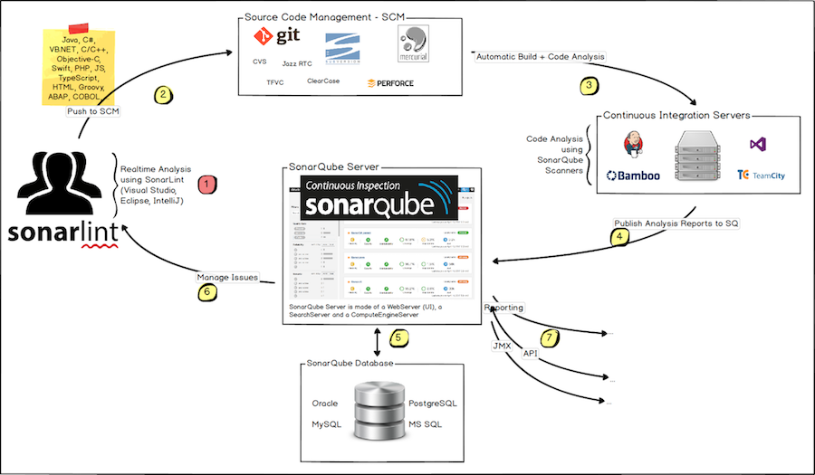

在整个项目的开发过程中，开发人员在编写代码之前，往往会制定相关的代码规范，虽然写完代码之后有code review的过程，但是难免会有code review发现不了的问题，往往一些潜在的bug或者坏味道的代码会出现在项目中,这时候如果有一个自动检查代码规范的工具，就能有效的避免一些问题，SonarQube就是提供了这样一个能力的工具，刚好前段时间我负责集成SonarQube的服务到我们项目中，集成的时候遇见的一些问题，在这里做一个回顾和总结。

## SonarQube是什么？
> SonarQube（曾用名Sonar（声纳）[1]）是一个开源的代码质量管理系统。--维基百科


上面是维基百科的介绍，看SonarQube官网的介绍，SonarQube就是一个代码质量的检查工具，能够将代码中潜在的bug、坏味道的代码、代码存在的安全漏洞检查出来；SonarQube对主流编程语言的的支持还是不错的，官方称支持20+的编程语言，如果不是使用太冷门的语言都是可以使用SonarQube的；并且SonarQube完全可以集成进你的持续集成工具中，提供了完全自动化的分析。

## SonarQube的架构

如上是SonarQube各个部分的组件，其实如果要搭建一个完整的SonarQube服务，从整体上来看分成两个大的部分，一个部分是Sonar Scanner，一个是SonarQube Server；SonarQube Scanner负责从SonarQube拉取规则，扫墓工程目录下的代码，将扫描结果回写给SonarQube Server，Scanner和Server不一定在同一台机器上。如上SonarQube Server在运行时主要由三个主要的进程组成：

- Web Server是负责代码质量的报告在UI上的展现，以及在用户界面上对SonarQube实例的配置
- Search Server是依赖于Elasticsearch，提供搜索的能力
- Compute Engine负责处理代码分析的报告，以及将相关数据存入数据库的操作

SonarQube Server上的数据库存储了SonarQube的配置信息（插件、安全设置等信息），以及每一次分析报告的快照；从这里可以看出，SonarQube Server其实就是一个配置管理、结果分析查询的服务，SonarQube本身并不参与到项目代码的扫描分析中，扫描分析这一部分的工作是Sonar Scanner负责的，一般是集成到项目中的持续集成工具中的。

## 安装SonarQube Server
安装SonarQube Server到Ubuntu，按照[How to Install SonarQube on Ubuntu 16.04](https://www.vultr.com/docs/how-to-install-sonarqube-on-ubuntu-16-04)这个链接的步骤，即可安装成功，这里要注意的是，以上链接提供的方式存在一个问题就是，如果你安装的SonarQube版本是6.7+(推荐装6.7 LTS的版本)，并且你以root权限启动服务，在6.7的[更新](https://docs.sonarqube.org/display/SONARQUBE67/Release+6.6+Upgrade+Notes)中，出于安全的考虑，不能以root权限启动，这里切成其他非root权限启动即可，但是在切换用户之后，需要将temp目录下的root文件清除掉。

## 集成SonarQube到项目中
在搭建好SonarQube Server之后，我们需要将其集成到我们的工程目录中，如下图是在整个项目中，SonarQube是怎样工作的：


- 在客户端装上Sonarlint，Sonarlint会在你写代码的时候，应用Sonarlint的规则，检查你当前打开文件
- 在你将代码push到SCM上之后，你需要在你的持续集成工具上安装Sonar Scanner，然后在项目根目录下运行Scanner
- Scanner分析完代码之后，将分析结果写会到SonarQube Server（在项目根目录下需要放置Sonar的配置文件），如下：


```
    # must be unique in a given SonarQube instance
    sonar.projectKey=#SonarQube项目的key
    # this is the name and version displayed in the SonarQube UI. Was mandatory prior to SonarQube 6.1.
    sonar.projectName=#SonarQube项目名
    # sonar.projectVersion=1.0
    sonar.host.url=#SonarQube搭建的地址
    # Path is relative to the sonar-project.properties file. Replace "\" by "/" on Windows.
    # This property is optional if sonar.modules is set. 
    sonar.sources=#需要分析的代码目录
    sonar.login=#在Sonarqube中生成sha5码，让Sonar Scanner有访问权限
    
    # Encoding of the source code. Default is default system encoding
    sonar.sourceEncoding=UTF-8 # 编码格式
```


如上在项目根目录下新建一个名为`sonar-project.properties`的文件，按照以上的配置即可。


## 集成SonarQube到Bitbucket
在以上的集成中，存在一个问题就是每次SonarQube分析完之后，开发人员需要自己去SonarQube网站上去查看分析结果，但是如果这次的代码的提交并没有导致问题，那么这次查看明显是浪费时间，如果每次对于新提交的代码，仅仅在出了问题之后才通知开发，这样能够减少开发人员频繁的去查看SonarQube报告。

我们组里使用的是Bitbucket Cloud做源码的托管，这里有一个[插件](https://github.com/mibexsoftware/sonar-bitbucket-plugin)，在你发pull request后，SonarQube分析完结果，如果扫描出问题，会将有问题的代码及原因以comments的形式写到对应的comments上去，非常方便，如果使用Bitbucket的话可以使用这个插件。

-----
***兴趣遍地都是，坚持和持之以恒才是稀缺的***
