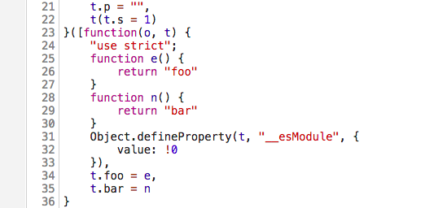
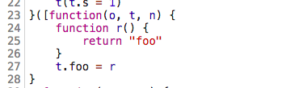
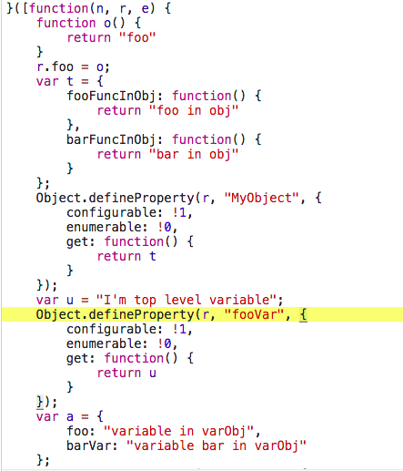

## TL;DR;
- 前端打包中会将多个module打包成一个bundle发给客户端，但是各个module中存在并不会使用到的东西，dead code elimination是一种可以消除这些代码的技术
- Tree Shaking是Dead code elimination（简称DCE）的一种实现
- Webpack中的tree shaking需要es6的`import/export`的支持
- Webpack中的tree shaking仅仅能作用与顶层函数、顶层变量、顶层对象，如果定义一个函数集合的Object，如果仅仅只使用了一部分函数，其他的函数仍然会被打进去
## 什么是Tree Shaking
  在前端开发的过程中，一般整个代码会分散在项目的各个模块中，但是在最后在发送给客户端的时候，往往是一个大的bundle文件，各个模块的文件打包成一个JS文件，但是伴随而来的问题就是，某些永远跑不到的代码也会打到最后的bundle文件中，这就无形中增加了bundle的size。
  `Dead code elimination（简称DCE）`是一种可以消除最后编译产物中无用的代码的技术，就以上出现的问题DCE技术可以移除无用的不相关的代码，以达到减小产物size的作用。
```javascript
    function add(a, b) {
        const c = a + b;
        return c;
        const m = a * b;  // unreachable code
        return m;
    }
    
    function bar(a, b) {
        const c = a * b;
        if(0) {  // unreachable code
            // do something
        }
    }
```
  以上的代码就是一个典型的可以通过`DCE`消除掉的例子，但是在前端`webpack`中可以消除掉这些永远跑不到的代码，但是存在一个问题就是如果你`import`了一个模块，这个模块暴露出了两个函数，你在运行时只使用了其中一个，那么在最后打包的时候另外一个函数也会被打进去，代码如下：
 ```javascript
    // helper.js
    export function foo() {
        return 'foo';
    }
    export function bar() {
        return 'bar';
    }
    
    // main.js
    import {foo} from './helpers';
    console.log(foo());
 ```
   如上在这种情况下，我们只使用了`foo`函数，没有使用`bar`函数，最后使用`webpack`打包之后，我们不需要`bar`函数的代码，因为没人去调用它，但是`webpack`如果没有配置`tree shaking`的话，`bar`还是会被打进最后的`bundle`。
   `tree shaking`就是一种`DCE`技术，发源于`Lisp`，最早在JS中是在`google closure`中使用，后来`rollup`的作者在`rollup`中引入了`tree shaking`这个技术，同时在`webpack4`中也实现了相应的功能。
## Tree Shaking的限制
  `Tree Shaking`的原理简单来说，就是程序的执行能够被一颗由函数调用组成的树表示，如果一个函数没有被调用到，那么这个函数就可以被消除掉；但是在`commonJS`中，`module`的加载不是静态的，这时候去做静态语法分析是比较困难的，但是`es6 moudle`的出现，使得这个问题变简单了，所以`tree shaking`的先决条件是你的`module`使用的是`es6`的`import/export`。
## Tree Shaking在Webpack中的使用
  配置`webpack babel loader`的插件：
  ```javascript
     {
             loader: 'babel-loader',
             test: dir_js,
             query: {
             // presets: ['es2015'],

            // All of the plugins of babel-preset-es2015,
            // minus babel-plugin-transform-es2015-modules-commonjs
            plugins: [
              // 'babel-plugin-transform-es2015-modules-commonjs',
              'transform-es2015-template-literals',
              'transform-es2015-literals',
              'transform-es2015-function-name',
              'transform-es2015-arrow-functions',
              'transform-es2015-block-scoped-functions',
              'transform-es2015-classes',
              'transform-es2015-object-super',
              'transform-es2015-shorthand-properties',
              'transform-es2015-computed-properties',
              'transform-es2015-for-of',
              'transform-es2015-sticky-regex',
              'transform-es2015-unicode-regex',
              'check-es2015-constants',
              'transform-es2015-spread',
              'transform-es2015-parameters',
              'transform-es2015-destructuring',
              'transform-es2015-block-scoping',
              'transform-es2015-typeof-symbol',
              ['transform-regenerator', { async: false, asyncGenerators: false }],
       		],
                },
            }
  ```
  如果要让`tree shaking`起作用，那么将es6插件中的`babel-plugin-transform-es2015-modules-commonjs`去掉，避免打成`commonJS`的包，不然`tree shaking`没用。
  
  如下我们有以下代码，我们使用`webpack`来编译它们，来看看使用`tree shaking`和不使用的区别：
  
  ```javascript
  	// helper.js
  	export function foo() {
    	if(0) {
          console.log('unreachable code');
        }
    	return 'foo';
	}
	export function bar() {
    	return 'bar';
	}
    
   // main.js
   import {foo} from './helpers';
   let elem = document.getElementById('output');
   console.log('test');
   console.log(foo)
   elem.innerHTML = `Output: ${foo()}`;
  ```
  使用`webpack`编译后的部分代码：
  
  
  
  如上图是在没有启用`tree-shaking`的时候打包之后的`bundle`，这里在最后的`bundle`文件中有没有使用的`bar`函数，下图是使用了`tree shaking`之后打包后的代码：
  
  
  
  可以看到在没有`tree shaking`的情况下没有使用的`bar`函数的代码也被打进了最后的`bundle`中，使用了`tree shaking`的将没有使用到的函数消除掉了。

## Tree Shaking真的很美好吗？
  看到这里你可能觉得`tree shaking`真的很美好，能够帮你把一切在运行时没有使用到的代码消除掉，但是遗憾的是，在实际情况下并没有这么美好，看看下面的例子：
  ```javascript
  	// helper.js
    // top level function
    export function foo() {
    	if(0) {
        	console.log('unreachable code');    
    	}
    	return 'foo';
	}
	export function bar() {
    	return 'bar';
	}
	
    // top level object
	export const MyObject = {
    	fooFuncInObj: () => {
        	return 'foo in obj';
    	},
    	barFuncInObj: () => {
        	return 'bar in obj';
    	},
	};
	
    
	export const MyObject1 = {
    	fooFuncInObj: () => {
        	return 'foo in obj';
    	},
    	barFuncInObj: () => {
        	return 'bar in obj';
    	},    
	};
	
    // top level variable
	export const fooVar = "I'm top level variable foo";
    export const barVar = "I'm top level variable bar";
	export const varObj = {
    	foo: 'variable foo in varObj',
        barVar: "variable bar in varObj",
	};
  ```
  
  ```javascript
  import { foo, MyObject, fooVar, varObj } from './helpers';
  let elem = document.getElementById('output');
  elem.innerHTML = `Output0: ${foo()} \n Output1: ${MyObject.fooFuncInObj()} \n Output2: ${fooVar}\n Output1: ${varObj.foo}`;
  ```
  如果`tree shaking`足够聪明，那么我们这里仅仅调用了`MyObject`下的一个函数，另外一个函数没有使用，同样的我们只使用了`varObj`下的一个变量，另外的变量不应该打到最后的`bundle`里面去，遗憾的是现实情况并不是这样，下图是`webpack`打出来的包：
  
  
  
  从上面的代码我们可以有这样的结论，`webpack`的`tree shaking`对顶层函数、顶层变量和顶层对象有作用。
## Reference
- https://en.wikipedia.org/wiki/Tree_shaking
- https://github.com/rauschma/tree-shaking-demo
- http://2ality.com/2015/12/webpack-tree-shaking.html

-----
***兴趣遍地都是，坚持和持之以恒才是稀缺的***