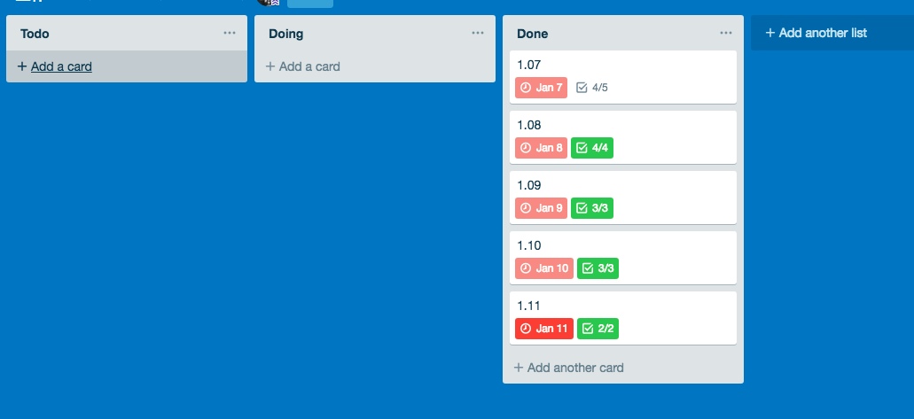

工作之后，自己的个人时间就变的少了，不像上学的时候那样有很多时间能自由安排，刚参加工作的时候自己的时间管理更是混乱，经常性的就是觉得这个周什么都没干，一个周就过去了，做事学东西也没有一个好的进度和时间的跟踪，在意识到这个问题之后，决定改变这个不好的习惯，自己也建立了一套自己的时间管理系统，很好的改善了当前的情况。这里主要是介绍自己的一些使用的工具，以及如何使用这些应用规划自己的时间。
## Google Calendar
[Google Calendar](https://zh.wikipedia.org/wiki/Google%E6%97%A5%E6%9B%86)是`Google`出品的日历应用，用来管理时间和活动

如果你给自己制定了固定的计划，像我每周一周四会去健身房健身，一开始没使用`Google Calendar`的时候，经常性的忘记或者不想去，使用`Google Calendar`将这些活动安排到一个固定的时间，包括一个周哪几天要去健身，跑步从几点开始到几点结束，都可以安排到`Google Calendar`的活动中，我一般是在活动开始的前半小时发消息通知，提前收拾东西出门；但是关键还是自己得执行，将自己的固定的活动安排到`Google Calendar`上，一是为了记录自己的执行情况，二是到了时间点做什么事有`Calendar`督促你，“变相”的提高自己的执行力；另外在周末的时候，头一天晚上或者当天早上可以通过`Google Calendar`安排今天或者明天要干的事，不至于一到周末就在床上躺一天，当然周末如果有聚会的话，我也会考虑在这个时间里，如果是很突然的聚会，和我安排的活动重叠的话，我会优先完成自己安排的活动，拒绝不必要的聚会。`Google Calendar`在我的时间管理系统中承担了“管家”的作用，基本上一些活动和时间安排我都会交给他。

## IFTTT
`IFTTT`是一个整合了各种主流应用`Web Service`的应用，主要的用途就是做触发器，怎么理解这个应用的应用场景呢？比如你在`Instgram`上上传了图片，但是重所周知的原因，国内上不了`Ins`，这时候你就得把图片在微博上又发一遍，这其实是个相当低效的操作，那么这时候你就可以使用`IFTTT`来定制你的触发器，当在`Instgram`上发图片之后，`IFTTT`将请求微博提供的对应接口将这个`post`中的图片在你的微博上发一遍。
我用`IFTTT`的主要目的是转发`Google Calendar`上的通知到我手机上，因为`Google Calendar`在不挂梯子的情况下收不到通知。`IFTTT`支持的主流应用还是国外的居多，整体的运行逻辑就是：
```javascript
	if (condition == true) {
		then do something
	}
```
最好用的是，满足这个触发器的执行条件之后的操作也可以触发其他的触发器，这样就将平时一些流水线的任务串起来，你要做的就是按下开关。
## Trello

`Trello`是一款看板应用，具体的介绍可以看维基百科 >  [Trello](https://zh.wikipedia.org/wiki/Trello)，`Trello`的作者这位老哥很厉害，是`StackOverflow`的创始人之一，同时你一定或多或少看到过他的文章，他的博客[Joel On Software](https://www.joelonsoftware.com/)的一些文章和观点会被国内的开发人员翻译，不得不说，`Joel`老哥给程序员这个群体树立了一个好的榜样，国内说实话IT这个行业是真的浮躁，动不动毕业生年薪要求大几十万，人工智能火，就一窝蜂的涌去人工智能，区块链火，就去搞区块链，程序员干到30岁就要转行，与其每天去焦虑这些问题，不如做好自己手头上的事。
一般来说我会在月初的时候制定好这个月要完成的事，然后落实到具体每天的时候，会将这些任务拆分成更小的粒度，这里的话只要每个月分配的量合理，基本上这个月能有条不紊的到达自己的目标，其实这套流程也是工作中接触到敏捷开发，将敏捷开发这一套迁移到我自己的学习生活中；另外，在工作中我会使用`Trello`来安排自己工作上的事，现在工作日一般是早上来到公司后，开完晨会，花点时间将今天要做的事拆一下，以日期为`Card`的`Label`，将今天要做的事情做成一个`ToDo List`，完成一项就划掉一项。这样对于完成的工作和未完成的工作有一个记录，最大的作用是在没周发周报的时候就不用痛苦的去回忆上一周干了啥，直接打开`Trello`就知道这周具体完成了哪些，遗留了哪些，也算是变相的省了时间。
## 番茄钟
前段时间读了[软技能](https://book.douban.com/subject/26835090/)这本书，中间提到了番茄管理法，以前也听过这个，但是并没有深入的去了解这个东西，自己认为是属于那种理想很美好，现实很骨感的东西，后面读完这本书，作者在谈到自己和自己朋友使用番茄工作法，如何以番茄钟来计算自己每天的工作量，同时像学习和编码这种需要很强专注力的工作的时候，如何提高和改善自己的专注力，也是一个技术活；一个番茄钟是25分钟，每一个番茄钟之后有5分钟的休息时间，四个番茄钟之后是一个长的`break`15分钟，这是番茄工作法的原则；我没有找到理论依据，但是在实践了一段时间之后，自己做事的效率确实有一定的提高；同时对于工作安排的时间也不像以前一样，想着大不了加班搞搞，刚入职的时候抱着这种心态，没有少加班，就是因为想着大不了加加班，工作时间内搞的时候不专注，寄希望于加班，一般来说我给自己规定每天工作时间是6到8个番茄钟，在这几个番茄钟专注的去做事情，效率有很大的提高。
番茄钟的应用很多，手机上的就不推荐了，自己去应用商店找一个自己喜欢的，最好电脑上也装一个，这里我推荐可以用用[Cherry Tomato](https://chrome.google.com/webstore/detail/cherry-tomato/cghomilbbfdmgfidkdinillpmdpdjgmm)，做的不错的一个应用，`Chrome`的扩展应用，免安装。

---
***兴趣遍地都是，坚持和持之以恒才是稀缺的***