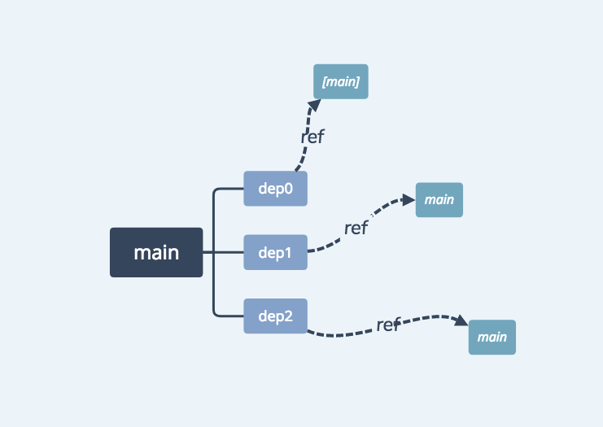
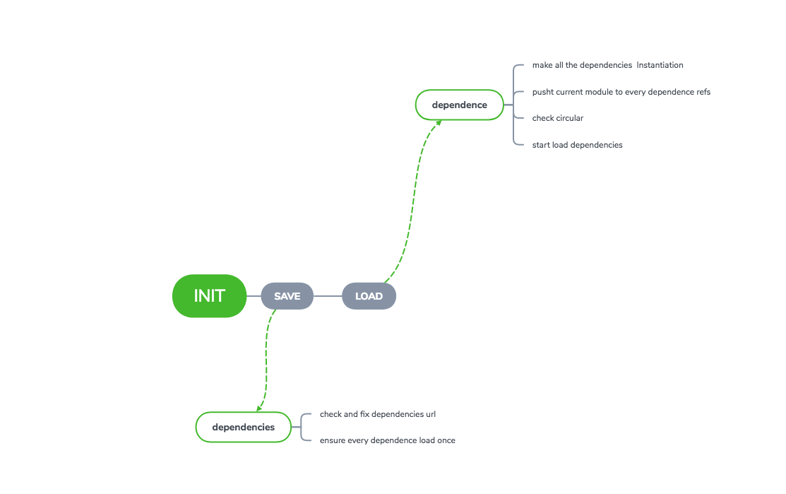

上一篇博客[Javascript模块化](http://cuteshilina.com/2019/02/06/Javascript%E6%A8%A1%E5%9D%97%E5%8C%96/)介绍了前端的模块化的一些方案和历史，基于浏览器的[`AMD`规范](https://github.com/amdjs/amdjs-api/wiki/AMD)，我们尝试自己实现一个`AMD Loader`。

# AMD Loader要解决的问题
`AMD`主要是为了解决浏览器端的模块化，实现`AMD Loader`的话，以下的点要考虑到：
- 前端的加载是异步的
- 模块的依赖也是模块（可能会出现循环依赖的问题）
- 每个Module只加载一次
- `AMD Loader`暴露 `define`和`require`

其实我们主要要解决的点在于，如何处理`Module`的加载。`Module`加载要解决两个主要问题，一是对模块的引用（对path的处理）；二是如何维护模块之间的引用关系。

# 模块代码的加载
首先来看看`define`的`API`接口：
```javascript
define(id?, dependence?, factory)
```
`define`的函数中`id`是表示当前模块的`id`，**`id`可以是字符串或者一个绝对路径的字符串**，这里规定不能出现相对`id`，例如'./myModule'或者 '../myModule'；`id`是可选的，如果没有提供`id`的话，默认`id`名是`Module`的在浏览器加载当前`Module`的`url`。
`dependence`，是一个字符串数组，字符串是依赖模块的`url`，可以是相对路径、绝对路径、字符串（如JQuery）。
所以，我们首先要解决的问题是，如何去规范化用户传进来的各种各样的`url`，例如，下面这些`url`的规范化：
```javascript
 ./a/b/c//d --> a/b/c/d
 ./a/b/c/../../d --> ./a/d
 ./a/b/c/./d --> ./a/b/c/d
 main/test?foo#bar --> main/test
```
对于这些`URl`，我们可以写正则表达式去匹配，在用户传入模块的'url'，需要过一遍我们的正则，将其规范化，对于依赖模块，我们要基于当前`Config`的`baseURL`（如果在config中配置了baseUrl的话），拼成完整的`url`，让浏览器的`script`去加载，在加载完之后，将对应的`script`删除。
```script
    function loadScript(url, callback) {
        var node = document.createElement('script');
        var head = document.head;
        node.setAttribute('data-module', url);
        node.async = true;
        node.src = url;
        
        function onload() {
            node.onload = node.onerror = null;
            head.removeChild(node);
            callback();
        }
        node.onerror = function(error) {
            node.onload = node.onerror = null;
            head.removeChild(node);
            callback(error)
        }
    }
```
如上，是使用`script`标签加载模块的一些代码，基本逻辑是：


`
    创建script标签 ---> 加载模块源码 ---> 模块加载完成后触发回调函数
`


这里主要是利用`script`标签来做模块的加载，这里给`script`标签加上了`async=true`的标志，浏览器在解析`HTML`页面的时候，不会因为加载`script`阻塞住页面的解析，在`script`加载成功后执行`script`中的代码。

# 模块的定义
在使用`AMD Loader`定义我们的`Module`的时候，使用`define(id?, dependence?, factory)`的接口来定义我们的`Module`，在实现模块定义的时候，我们可以预想到有以下问题：

- 模块的加载是异步的，意味着我们需要设计`notify`机制
- 我们需要解决模块循环依赖问题
- 模块仅仅被加载一次，需要有模块的`cache`


如上，对于`main Module`有`dep0, dep1, dep2`三个依赖，这里我们在定义`main Module`的时候，将`main Module`中的每个依赖（在声明中只有url）实例化成`Module`，在加载`main Module`的时候，得先要加载我们的依赖`Module`，这里因为`Module`的加载是异步的，所以在实例化我们的依赖的时候，在每个`Module`中保存一个`refs`的数组，这个数组中保存着依赖这个`Module`的`id`，当前`Module`加载完成之后，在`onload`的`callback`中去通知当前模块`load`完成，然后当前`Module`会查看当前`Module`的`refs`中所有的`Module`，在`refs`中这些`Module`就会收集自己所有的依赖是不是都加载完成，如果加载完成了，当前的`Module`就加载完成了，否则就触发当前`ref`的重新`load`（为了触发其他未被加载的依赖的加载）。

解决了`notify`的问题，剩下的两个问题主要是对`Module`状态的维护，如下图，是整个`Module`的加载的状态转移图：


依照上图的状态转移图，`Module Class`的设计如下：
```javascript
function Module(url, deps) {
    this.refs = [];
    this.depsUrl = getVaildUrl(deps);
    this.depsModule = [];
    this.STATUS = STATUS.INIT;
}

Module.prototype = {
    constructor: Module,
    fetch: function() {},  // 加载module的代码
    save: function(depsUrl), // 检测修正依赖的url，并剔除已经被加载的module的url
    resolve: function(), // 实例化每个依赖
    setDependencies: function(), // 设置依赖当前模块的refs
    checkCircular: function(), // 检测循环依赖
    makeExports: function(), // 调用Module的factory函数并输出exports
    load: function() {}, // 加载模块
}
```

对于Module本身来说我们这里也需要维护一个状态，来表明当前`Module`的执行状态：

`
init --> fetch --> save --> load --> executing --> executed or error
`

`AMD-Loader`的完整代码 --> [AMD Loader](https://github.com/Soyn/AMDLoader/blob/master/src/index.js)，**代码实现仅为了解AMD模块加载的原理，并不能用在生产环境下**。

# Reference
- [AMD加载器分析与实现](https://github.com/creeperyang/blog/issues/17)
- [https://github.com/creeperyang/amd-loader/blob/master/amd.js](https://github.com/creeperyang/amd-loader/blob/master/amd.js)
- [requireJS源码](https://github.com/requirejs/requirejs/blob/master/require.js)

---
***兴趣遍地都是，坚持和持之以恒才是稀缺的***