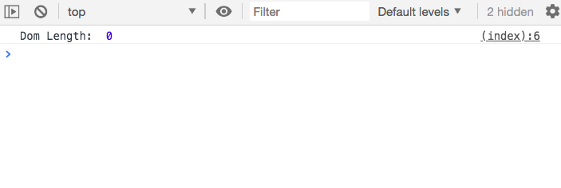
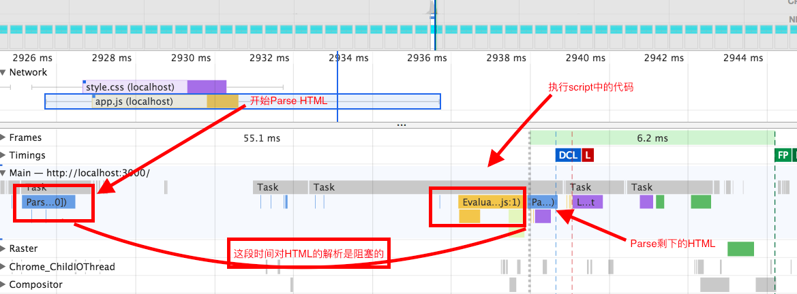
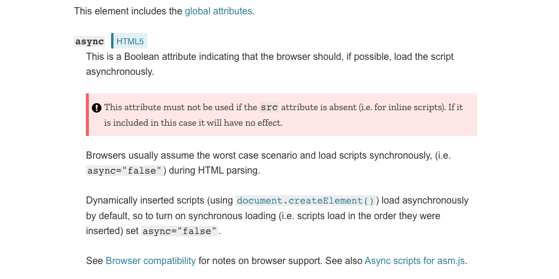
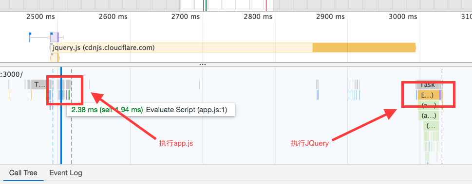
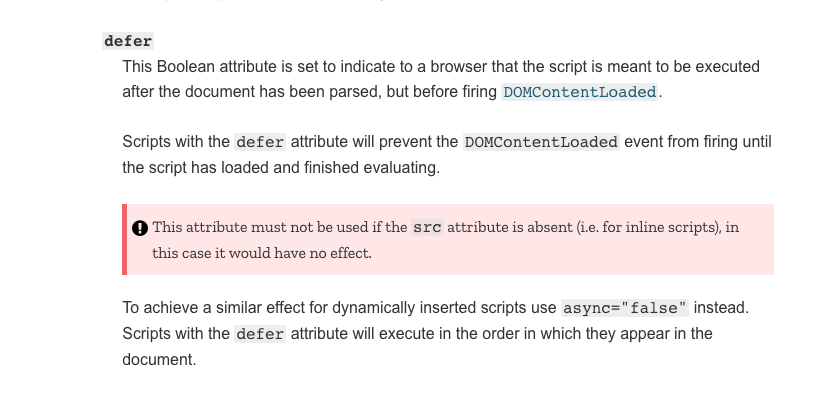

在访问网页的时候，浏览器是如何渲染当前的页面的？浏览器获取到输入（`HTML`、`CSS`、`Javascript`）的时候，输入中有`DOM Tree`的信息，有样式信息，`Javascript`代码，在加载页面的时候，如果`DOM`的加载和解析太耗时的话，首屏的大量留白是很影响用户体验的，这里我们来看看，对于`Scritp`在页面中的加载对`HTML`的加载的性能影响。

## Script在页面中的位置
`script`标签在页面中放置的位置对于整个页面的加载和功能影响是很大，默认情况下，浏览器在解析`HTMl`页面的时候，遇到`script`标签，如果是`inline`的话，会立即执行`script`标签中的代码，这里就牵扯一个问题，浏览器对`HTML`的解析是按照`HTML`内容的输入顺序执行的，如果`script`在`head`中，如果需要操作`DOM`，这个时候浏览器对文档的解析并没有结束，可能这时候需要的`DOM`并不存在。

```html
<html>
  <head>
    <link rel="stylesheet" href="./style.css"></link>
    <script type="text/javascript">
      function foo() {
        console.log('Dom Length: ', document.getElementsByClassName('test').length);
      }
      foo();
    </script>
  </head>
  <body>
    <div class="test">Test1</div>
    <div class="test">Test2</div>
    <div class="test">Test3</div>
    <div class="test">Test4</div>
    <div class="test">Test5</div>
  </body>
</html>
```

如上，是一个`inline`的`script`，在`script`的代码中去取`DOM`，这个时候浏览器在执行这段代码的时候，浏览器并没有解析到对应的`DOM`。



所以，为了避免这种情况，一般来说，会将script标签放置在`</body>`标签前，这个时候，所有的`DOM`都解析好了，不存在找不到`DOM`的情况。

```html
<html>
  <head>
    <link rel="stylesheet" href="./style.css"></link>
  </head>
  <body>
    <div class="test">Test1</div>
    <div class="test">Test2</div>
    <div class="test">Test3</div>
    <div class="test">Test4</div>
    <div class="test">Test5</div>
    <script type="text/javascript">
      function foo() {
        console.log('Dom Length: ', document.getElementsByClassName('test').length);
      }
      foo();
    </script>    
  </body>
</html>
```


## 外部Script的加载对HTML解析的影响
在加载外部的`script`的时候，`script`的加载对于页面的性能影响更加明显，加载外部脚本的时候牵扯发外部的请求去请求脚本，这个时候`HTML`的解析是被阻塞住的，外部`script`加载成功后，马上执行`script`脚本，执行完后，才继续解析剩下的`HTML`。

```html
<html>
  <head>
    <link rel="stylesheet" href="./style.css"></link>
  </head>
  <body>
    <div class="test">Test1</div>
    <div class="test">Test2</div>
    <div class="test">Test3</div>
    <div class="test">Test4</div>
    <div class="test">Test5</div>
    <script type="text/javascript" src="./app.js"></script>
  </body>
</html>
```


从上图的`profile`的图我们可以发现，浏览器在解析`HTML`的时候，默认在解析到`script`标签的时候，会加载对应的`Javascript`代码，加载完成后立即执行，这个过程会将`HTML`解析阻塞住，那有没有办法解决页面阻塞的问题呢？在`HTML5`中引入了`async`和`defer`这两个属性，可以解决`script`加载阻塞页面解析的问题。
## Script中的Async和Defer属性
首先我们看看`MDN`对这两个属性的解释：

如上，是`async`属性对`script`标签的加载和执行的影响：
- `async`为`true`的`script`是异步加载和执行的，加载过程不会阻塞浏览器对`HTML`的解析
- 有多个`async`为`true`的`script`的执行的顺序是不确定的，执行顺序并不是脚本的引用顺序

```html
<html>
  <head>
    <link rel="stylesheet" href="./style.css"></link>
  </head>
  <body>
    <div class="test">Test1</div>
    <div class="test">Test2</div>
    <div class="test">Test3</div>
    <div class="test">Test4</div>
    <div class="test">Test5</div>
    <script type="text/javascript" async=true src="./app.js"></script>
  </body>
</html>
```

从上面的`profile`的图可以很明显的看到这个过程，`Javascript`的加载和`HTML`的解析是并行的，并不会阻塞`HTML`的`parse`，但是`javascript`代码的执行的实际这里是无法确定的。

```html
<html>
  <head>
    <link rel="stylesheet" href="./style.css"></link>
  </head>
  <body>
    <div class="test">Test1</div>
    <div class="test">Test2</div>
    <div class="test">Test3</div>
    <div class="test">Test4</div>
    <div class="test">Test5</div>
    <script type="text/javascript" async=true src="https://cdnjs.cloudflare.com/ajax/libs/jquery/3.3.1/jquery.js"></script>
    <script type="text/javascript" async=true src="./app.js"></script>
  </body>
</html>
```

如上，我们在这里从`cdn`上引入了`JQuery`的代码，我们来看看这里`async=true`的时候，对`javascript`代码的执行情况的影响。

在上面的`profile`的图中，我们可以很明显的看到，`javascript`代码的执行顺序，和`script`的引入顺序并不一致。
我们接着来看看`defer`属性对`script`标签的影响：

根据`MDN`的解释，在`defer`属性为`true`的情况下，`script`标签会异步加载，脚本的执行是按照`script`标签在`HTML`中出现顺序执行，等所有的`script`执行完毕之后才会触发`DOMContentLoaded`事件。

对于`script`的加载和执行，结合文中实际的例子，我们总结一下：
- `script`标签默认是同步加载，加载完成之后立即执行
- `async`为`true`的时候，`script`的加载是异步的（不会阻塞`HTML`的解析过程），代码的执行顺序不一定是`script`标签出现的顺序。
- `defer`的加载和`async`是异步的不会阻塞`HTML`的`parse`，和`async`区别在于，`defer`标签的执行是按照在文档中定义的顺序执行的，在代码执行完毕之后才触发`DOMContentLoaded`，`async`的代码的执行并不对`DOMContentLoaded`有影响（代码的执行可能在`DOMContentLoaded`事件之后，意味着如果在`async`为`true`的脚本中拿不到`DOMContentLoaded`的事件)]

# Reference
- [Efficiently load JavaScript with defer and async](https://flaviocopes.com/javascript-async-defer/)
- [The Script element](https://developer.mozilla.org/en-US/docs/Web/HTML/Element/script)

---
***兴趣遍地都是，坚持和持之以恒才是稀缺的***