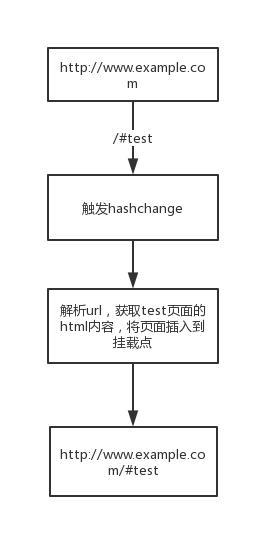
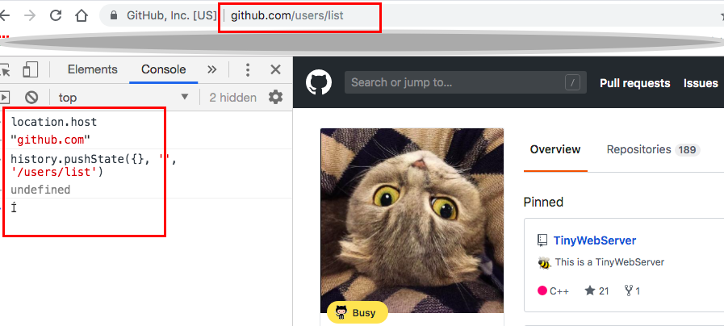
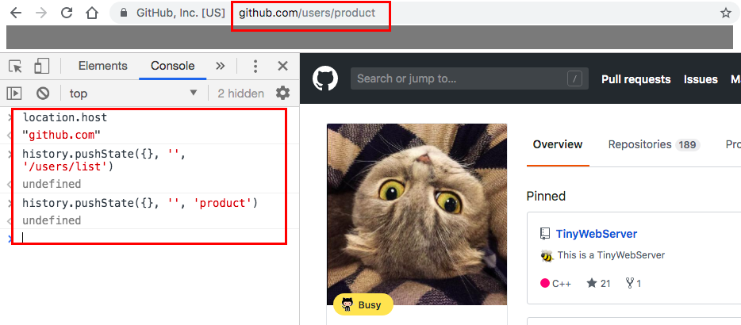

## 什么是路由？
路由最一开始是在后端中出现的，我们在访问某些网站的时候经常会见到类似于这样的`url`:
`http://www.xxx.com/xxx.php` 或者 `http://www.xxx.com/xxx.html`，这就是`SSR`（Server Side Render）服务端渲染，通过后端直接渲染前端页面。这里客户端会发向服务端发请求，服务端解析`url`，根据`url`将需要的资源返回给前端，路由其实就是前端和服务端的一种交互方式，相当于服务端针对于`不同url`的`switch case`，每一类`case`对应一个`controller`。
## 前端路由
上面介绍了传统意义上的路由，用户在页面上点击的时候触发页面请求，服务端将对应的页面返回回来，这样存在一个问题是，整个页面会重新加载，会产生无意义的白屏页面，用户体验不好。在用户点击访问网站或者`Web App`上的另一个页面的时候，这个时候我们可能仅仅需要的是更新部分视图就可以了，而没有必要去重新加载整个页面，避免无意义的白屏；这个时候前端路由就出现了，页面的跳转和渲染放在前端，后端提供`API`获取数据即可。
## 前端路由的实现原理
对于前端路由有两种实现方式，一种是通过[`hashchanged`](https://developer.mozilla.org/en-US/docs/Web/API/Window/hashchange_event)；另一种是使用`HTML5`提供的`history api`来做前端路由的处理。
对于`hasnchange`的实现方式，我们需要监听`hashchange`事件，在浏览器的`url`中改变`hash`不会导致页面发请求，我们在`hashchange`的事件回调中处理页面中`DOM`的刷新。

在`html5`推出`pushstate`和`replacestate`之后，就可以通过这两个`api`来改变`url`并且不发请求，而且相比于使用`hash`，页面的`url`更加美观，但是通过`pushstate`方式改变了`url`，如果这个时候刷新了页面，服务端会收到请求，这个时候后端没有对应的`controller`来处理，所以在`pushstate`的实现方式下，后端最好对于没有路由的`url`直接返回到主页面。
## 如何实现一个简单的前端路由
这里我们来尝试实现一个简单的前端路由，主要的思想就是侦测`url`的变化，解析`url`，调用`handler`，整个路由是一个单例。
```javascript
const Route = {
    routes: [],
    config: function(options) {
        this.root = options.root || '/';
        if (options.mode === 'history' && typeof history.pushState === 'function') {
            this.mode = 'history';
        } else {
            this.mode = 'hash';
        }
        return this;
    }
}
```
基于浏览器的两种实现方式，我们实现路由的时候，提供`mode`的设置，默认是'hash'的实现，这里我们配置了根路径，这里主要是处理在`pushstate`的实现中，`pushstate`导致无法获取到`url`改变的部分的问题：


如上图，我们原本的页面在`https://github.com`下，在第一次`pushstate`的时候，没有问题，但是在第二次`pushstate`的时候，和我们期待的`url`并不符合，这会导致的问题是，我们在解析`url change`的部分的时候，会得到错误的结果，所以这里我们指定好根目录，在解析的时候将`url`中根路径剔除掉。
```javascript
  getFragement: function () {
    let fragement = '';
    if (this.mode === 'history') {
      fragement = location.pathname + location.search;
      fragement = this.clearSlash(fragement);
      fragement = fragement.replace('/\?(.*)$/', '');  // replace the query string
      fragement = this.root !== '/' ? fragement.replace(this.root, '') : fragement;
    } else {
      fragement = location.hash.slice(1);
    }
    return fragement;
  }
```
上面的代码就是去解析出'url'改变的部分；在`pushstate`的实现中，存在一个问题是，我们在`url`跳转的时候，是调用`pushstate`来改变`url`，但是这并不能触发`popstate`的事件，所以这里我们需要去`listen url`的变化：
```javascript
  startTimer: function(fn, ms) {
    const self = this;
    const internalFn = function () {
      fn();
      self.timer = setTimeout(internalFn, ms);
    }
    this.timer = setTimeout(internalFn, ms);
  },
  listen: function () {
    let current = this.getFragement();
    let self = this;
    const fn = function() {
      if (current !== self.getFragement()) {
        current = self.getFragement();
        self.check(current);
      }
    };
    this.startTimer(fn, 50);
    return this;
  },
```
完整的代码实现请查看： [FERoute](https://github.com/Soyn/FERoute)


## Refrence
- https://www.zhihu.com/question/53064386
- https://juejin.im/post/5b40c1ede51d4518f140f84b
- [前端管理路由相比后端有什么优势？ - 知乎](https://www.zhihu.com/question/63586494)
- http://krasimirtsonev.com/blog/article/deep-dive-into-client-side-routing-navigo-pushstate-hash
- [GitHub - SME-FE/sme-router: A lightweight router lib that implement with express route style](https://github.com/SME-FE/sme-router)
- https://developer.mozilla.org/en-US/docs/Web/API/History_API
- [GitHub - krasimir/navigo: A simple vanilla JavaScript router with a fallback for older browsers](https://github.com/krasimir/navigo)
[Server-side vs Client-side Routing – Wilbert Schepenaar – Medium](https://medium.com/@wilbo/server-side-vs-client-side-routing-71d710e9227f)

---
***兴趣遍地都是，坚持和持之以恒才是稀缺的***