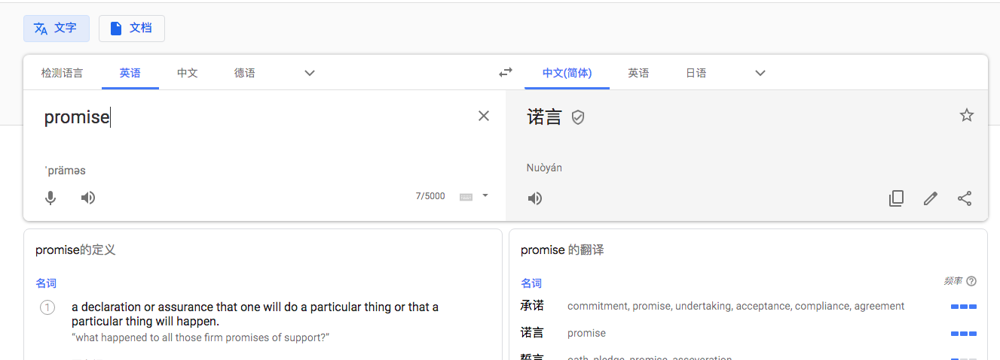
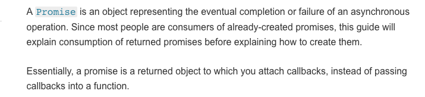
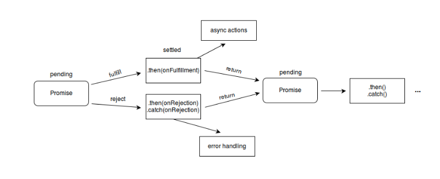

# 什么是Promise？
`Promise`英文翻译过来是诺言、承诺的意思



顾名思义，`Promise`的潜在含义是：
- `promise`代表的是还没发生的事
- 在事情没有完成之前，无法确定是成功还是失败

而在`Javascript`中的`Promise`代表的意义是类似的，对于异步操作（网络请求、文件I/O等）这些事情在完成之前无法确定其状态，在完成的时候要么成功要么失败，`Promise`会在完成的时候通知你。



上面是`Promise`的定义，`Promise`是一个表示异步事件处理完成的对象，我们看看传统的异步操作是怎样的：
```javascript
    function successCallback(result) {
        console.log('Result is ready: ', result);
    }
    
    function failureCallback(error) {
        console.log('Error on async request: ', error);
    }
    requestData(options, sucessCallback, failureCallback)
```
在传统的异步操作下，整个接口的定义实现方式，没有一个清晰的定义，不同的人去写，接口的定义方式不一样。
```javascript
    function successCallback(result) {
        console.log('Result is ready: ', result);
    }
    
    function failureCallback(error) {
        console.log('Error on async request: ', error);
    }
    requestData(options).then(successCallback).catch(failureCallback)
```

在`Promise`中，抽象出了异步操作成功（then）的接口和失败的接口（catch/reject），并且支持链式调用，在传统的`callback`的实现中，如果下一个异步操作依赖于上一个操作，很容易写出`callback hell`的这种代码，对于代码的阅读和维护带来麻烦。

# Promise的状态
`Promise`对象对象是一个代理对象，被代理的值表示一个异步操作，在创建的时候，对于最终异步操作的返回结果是未知的，`Promise`允许为异步操作的成功和失败分别绑定相应的处理方法，让异步方法可以像同步方法一样返回值，但并不是立即返回最终的执行结果，而是一个代理了未来出现的结果的`Promise`对象，`Promise`有以下几种状态：

- `pending:`初始状态，创建`promise`之后，执行还没结束的时候
- `fulfilled：`异步操作成功
- `rejected:`异步操作失败



如上图，在`promise`创建后，所处的状态为`pending`状态，执行成功或失败的这个过程叫`settled`，`settled`之后，`promise`由`pending`状态转换到`fulfilled`或`rejected`状态，并执行相应的回调。

# How to use Promise?

我们首先来看看`Promise`提供的方法：

## Constructor
常见的方式是通过`Promise`的构造函数得到Promise的实例：
```javascript
    function executor(resolve, reject) {
        const r = asyncWork();
        r.on('success', (s) => {
            resolve(s);
        })
        r.on('error', (e) => {
            reject(e);
        })
    }
     const p = Promise(executor)
```
如上`Promise`的构造函数接收一个`executor`函数为参数，这个`executor`一般来说是一个异步操作，在生成实例的时候会被执行，在执行成功的时候调用`resolve`，失败的时候调用`reject`。

## 实例方法

- `Promise.prototype.then(onFulfilled?, onRejected?)`，在`promise resolve`的时候`onFulfilled`会被调用，`reject`的时候`onReject`会被调用，这两个参数是可选的，如果你只想对异常进行处理的话，可以使用`promise.then(undefined, onRejected)`
- `Promise.prototype.catch(onRejected)`，`catch`方法会在`promise reject`的时候被调用。
- `Promise.prototype.finally(onFinally)`，向当前`promise`添加一个回调函数，无论当前`promise`的状态是完成还是失败都会被调用

## 静态方法

- `Promise.resolve(value)`，返回一个由给定`value`决定的`promise`对象；如果这个`value`可以是一个`thenable`的对象（带有`then`方法的对象），最终返回的`promise`对象的状态由`then`方法执行决定；否则的话，返回的`promise`对象状态为`fulfilled`，并且将该值传给对应的`then`方法，如果你不知道一个值是否是`Promise`对象，使用`Promise.resolve(value)`来返回一个`Promise`对象，这样就能将该`value`以`Promise`对象的形式使用。
- `Promise.reject(reason)`，返回一个执行状态为`rejected`的`Promise`对象，并将错误信息给到对应的处理函数
- `Promise.race(iterable)`，当`iterable`中的任意一个子`promise`成功或者失败后，父`promise`会使用这个子`promise`的结果，传给父`promise`绑定的回调上
- `Promise.all(iterable)`，这个方法返回一个`promise`对象，只有`iterable`中所有的`promise`执行成功的时候才会触发成功，一旦由任何一个执行失败都会触发要返回这个`promise`额失败，最终`iterable`的返回结果和`iterable`的顺序一致。

`promise`是支持链式调用的：
```javascript
    Promise.resolve({
      then: (resolve, reject) => {
        resolve(1);
      }
    })
    .then((r) => {
      console.log(r)
    })
    .then(() => {
      console.log(2)
    })
    .finally(() => {
      console.log(3)
    })
    .then(() => {
      console.log(4)
    })
```
## Promise的错误处理
```javascript
    // use `catch`
    new Promise((resolve, reject) => {
      console.log('Init')
      resolve()
    })
    .then(() => {
      throw new Error('error')  // {A}
    })
    .then(() => { // {B}
        console.log('123');
    })
    .catch(() => {
      console.log('Error was caught!')
    })
    .then(() => {
      console.log('End')
    })
    
    // use reject
    new Promise((resolve, reject) => {
      console.log('Init')
      resolve()
    })
    .then(() => {
      throw new Error('error')
    })
    .then(() => {
      console.log('End')
    }, () => {
      console.log('Error was caught!')
    })
```

`promise`在处理错误的时候，可以通过`Promise.ptototype.catch`或者是注册的`reject`方法来处理错误，在`{A}`行处，抛出了错误，这里`promise`的状态会变为`rejected`，会调用对应的回调函数，在`{A}`到`.catch`之间的`promise`链会被打断。

# Wraaper by Promise
```javascript
    function delay(ms) {
        return new Promise((resolve, reject) => {
            setTimeout(resolve, ms);
        })
    }
```

我们在使用`setTimeout`的时候，`setTimeout`执行的函数如果执行发生了错误，并且在函数的实现中并没有做`Error Handling`，函数执行发生错误的时机我们并不知道，如果使用上面基于`promise`包裹之后的`timeout`，我们是可以明确知道错误发生的时机的。

## 超时Promise
`promise`创建之后，会等待异步操作的执行，如果异步操作的时间很长的话，这个`promise`一直处于  `pending`状态，对于用户来说，页面会一直停留在`loading`的状态，显然，用户体验并不好，因此，对于这种情况，我们需要提供可以在超时之后，取消`promsie`的机制：

```javascript
    function delayPromise(ms) {
        return delay(ms).then(() => {
            console.error('Operation is timeout!');
        })
    }
    function timeoutPromise = (asyncFn, ms) {
        return Promise.race([
            new Promise(asyncFn),
            delayPromise(ms)
        ]);
    }
```
如上我们基于`Promise.race`实现了超时`promise`。

## Refrence
- [Promise迷你书](http://liubin.org/promises-book/)
- [Promise](https://developer.mozilla.org/zh-CN/docs/Web/JavaScript/Reference/Global_Objects/Promise)

---
***兴趣遍地都是，坚持和持之以恒才是稀缺的***


