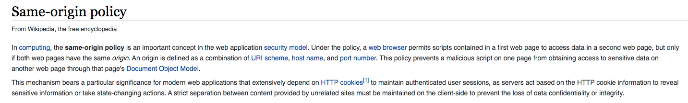
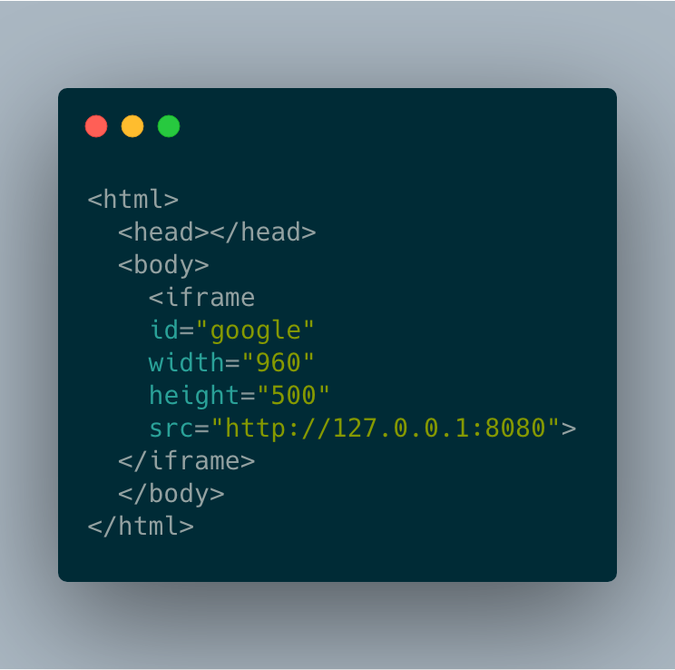
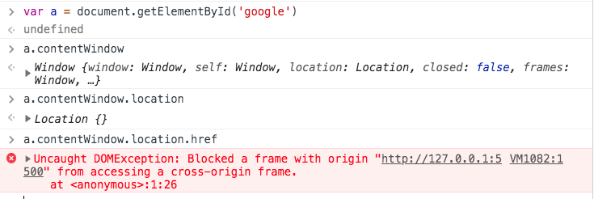
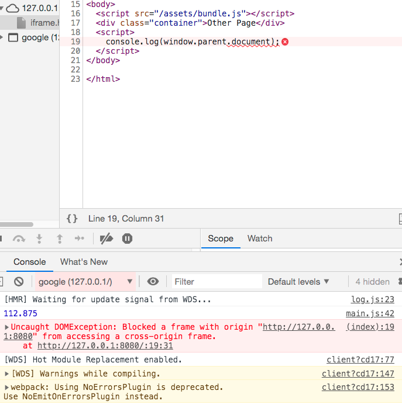
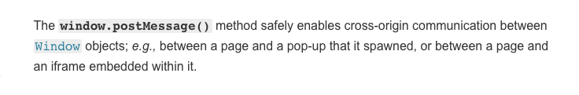
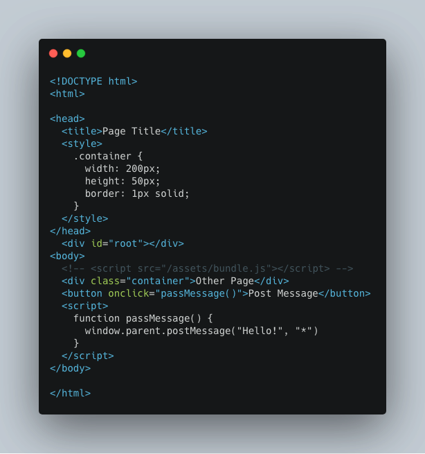
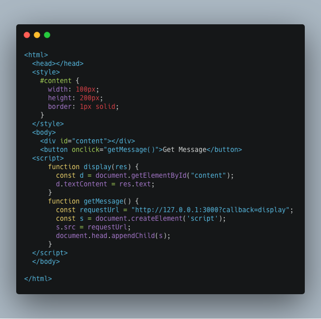
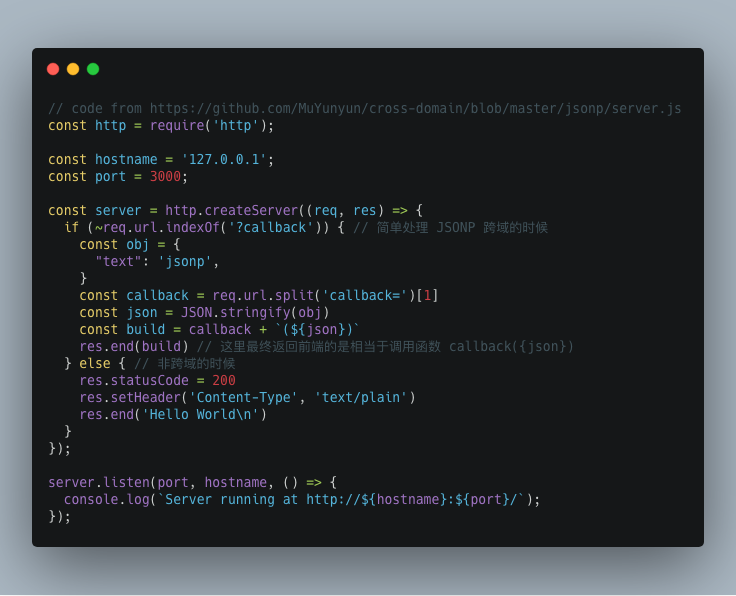

---
 
title: 浏览器同源策略
date: 2019-5-11  17:00:00
author: WangYao
category: 'Tech'
---
# 什么是同源策略

上面是`Wikipedia`对同源策略的定义，简单来说同源策略就是限制不同的源（`Domain`）之间的交互的安全策略。想象如果没有同源策略的限制，你访问银行的网站A时的登录信息，在你访问另一个网站B的时候，B网站可以拿到A网站的信息，如果B网站有恶意的代码，就可以直接访问你的银行账户。
同源策略中的同源，是三个相同：
- 协议相同
- 域名相同
- 端口号相同

以`http://www.example.com`为例：

| URL                                  | Outcome     | Reason         |
| ------------------------------------ | ----------- | -------------- |
| http://www.example1.com              | Failure     | 域名不同       |
| http://www.example.com:8080          | Failure     | 端口号不同     |
| http://www.example.com/dir/page.html | Same Origin | 仅仅是path不同 |
| https://www.example1.com             | Failure     | 协议不同       |

# 同源策略限制的范围
同源策略对跨源访问的控制可以分为三类；
- 对跨域资源的`写操作`是可以，例如表单提交、重定向这些不受同源策略的限制
- 一些替换元素（img、audio、video等）不受同源策略的限制
- 不同源之间的资源读操作（获取cookie、localStorage、DOM、AJAX请求等）受到同源策略的限制

对于开发人员来说，第三条限制，跨域资源之间的读取受到限制，这个是最常遇见的问题，对于第二条中一些HTML原生标签不受跨域访问的限制，可以用来`hack`掉同源策略的限制，以下资源是不受同源策略限制的：
- `<script>标签`
- `外部CSS的加载<link rel="stylesheet" href="...">`
- `标签`
- `<video>和<audio>标签`
- `<object>、<embed>（<applet>也不受同源策略限制，但该标签已经被废弃）`
- `@font-face引用的字体（浏览器实现有差异，有些要同源）`
- `<iframe>中嵌入的内容`

# 如何突破同源策略的限制
## Change Origin
在网页上可以通过设置`document.domain`设置当前页面所在的域，例如，在页面`http://store.company.com/dir/page.html`中的`JS`脚本执行了下面的代码：

```javascript
document.domain = "company.com"；
```
那么在当前网站上去获取`http://www.company.com`的网站上的资源是不受同源策略的限制的，但是这个改变`domain`的方法仅仅用于二级域名获取一级域名的资源的时候，你不能在`http://www.company.com`的`domain`改变为`otherCompany.com`。
# iframe
`iframe`在的父子窗口如果不是同源的话，在访问获取彼此的DOM节点或者读取数据的话，会受到同源策略的限制，无法访问。

父窗口所在的域为`http://localhost:5500`，其中子窗口所在的域为`http://localhost:8080`，这里父子窗口是同源的，所以彼此在获取资源的时候，会受到同源策略的限制：


对于`iframe`额跨域问题，有三种解决办法：
- 使用`fragement`（hash tag）
- windows.name
- postMessage
## Fragement
这里的`fragement`指的是`url`中`#`后面的部分，在父窗口中把信息作为`hash`写入到子窗口的src上。
```javascript
    const originalSrc = document.getElementById('myFrame').src;
    const src = originalSrc + '#' + data;
    document.getElementById('myFrame').location.replace(src);
```
因为`url hash`的改变不会引起页面的刷新，但是会触发`onhashchange`的事件，在子窗口中监听`onhashchange`的事件。
```javascript
  function getData() {
      const data = window.location.hash;
      ......
  }
  window.onhashchange = getData
```
同样，子窗口也可以通过同样的方式，向父窗口传递数据：
```javascript
    parent.location.replace(parentUrl + "#" + data);
```
## `window.name`
`window.name`在页面进行跳转前设置的值，在跳转后也可以访问到，我们可以借助`window.name`的这个特性来解决跨域问题，整个流程如下：
- 在父窗口设置子`iframe`的`src`，在子窗口`load`成功后将`data`挂到`window.name`上，然后设置子窗口的`location.href`到与父窗口同域的页面
- 跳转到同域的页面后，父窗口就可以通过`window.name`拿到跨域页面设置的数据了
例如：
```javascript
    a.com/index.html  // {A}
    b.com/index.html  // {B}
    a.com/empty.html  // {C}
```
我们在`A`中加载完成后，在`A`页面中设置`src`为`B`页面的`url`，在`iframe`加载成功后，将数据设置到`window.name`上，然后改变自己的`location.href`为`C`页面，`C`页面加载成功后，`A`页面和`B`页面就是同源的了，这个时候`A`页面去子窗口上取`window.name`的值就不会因为跨域问题而报错了。 **使用window.name的关键是在设置完window.name后，要将页面跳转到与父窗口同源的页面，这样主窗口才能访问子窗口上设置的数据**
## window.postMessag
`html5`提供了`postMessage`的机制，用于不同源之间的通信：




在父窗口中监听`message`事件

`iframe`窗口和父窗口不是同源的，通过`postMessage`将消息发送给父窗口。
## JSONP
在浏览器中，`script`标签是可以从不同源的地址上加载而不受同源策略的限制，这就给我们提供了一种手段，绕过同源策略的限制，`JSONP`就是通过这种手段来达到跨域通信的，但是`JSONP`需要服务端的支持，将返回的`JSON`数据和`url`中的`callback`拼接起来，只要前端定义了这个函数，在浏览器看来，就是从服务端加载了一段带数据的函数调用。



## CORS
`CORS(cross-origin resource share)`规范了跨域请求的标准，通过`HTTP`头让浏览器允许跨域请求的发送，这个话题，我会在下一篇博客细讲。

## Refrence
- [Understanding CORS – Bartosz Szczeciński – Medium](https://medium.com/@baphemot/understanding-cors-18ad6b478e2b)
- [浏览器同源政策及其规避方法](http://www.ruanyifeng.com/blog/2016/04/same-origin-policy.html)
- [CORS](http://www.ruanyifeng.com/blog/2016/04/cors.html)
- [跨域实践二三事](https://github.com/MuYunyun/blog/issues/13)
- [CORS MDN](https://developer.mozilla.org/en-US/docs/Web/HTTP/CORS)

---
***兴趣遍地都是，坚持和持之以恒才是稀缺的***