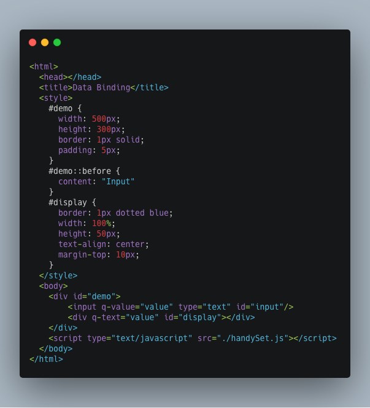
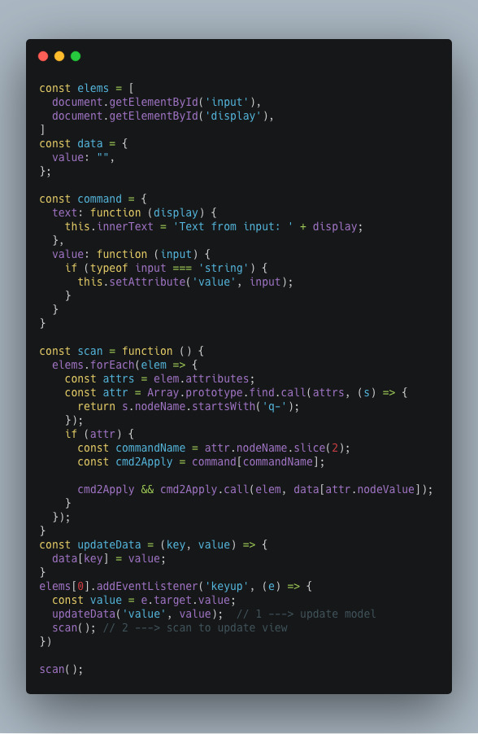
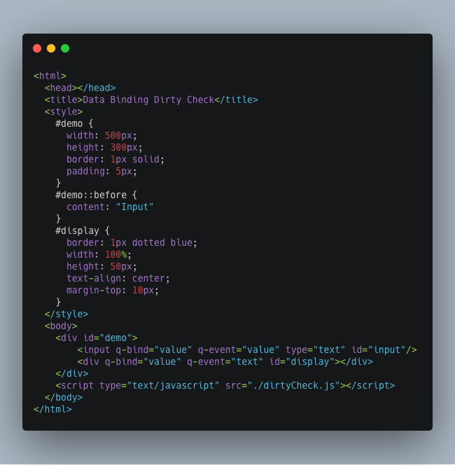
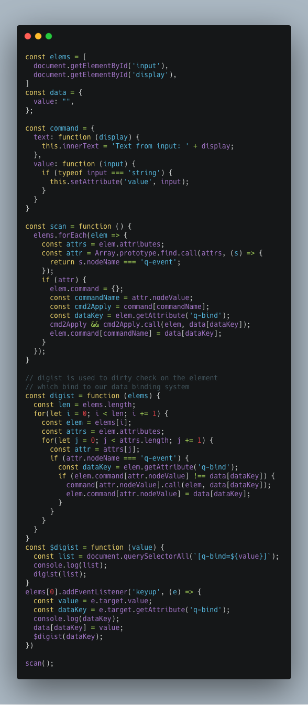
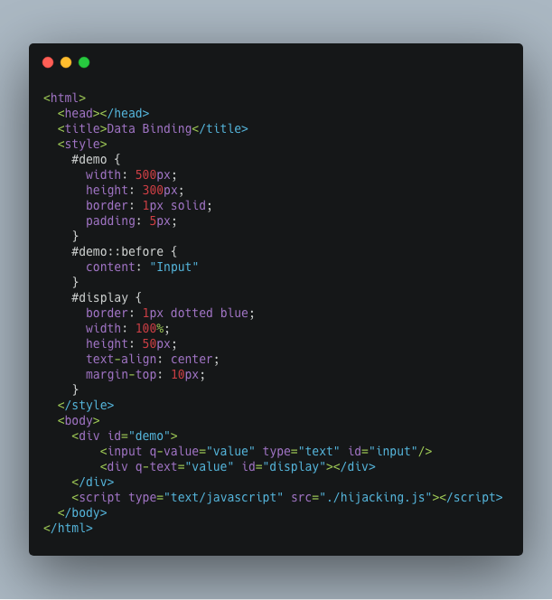
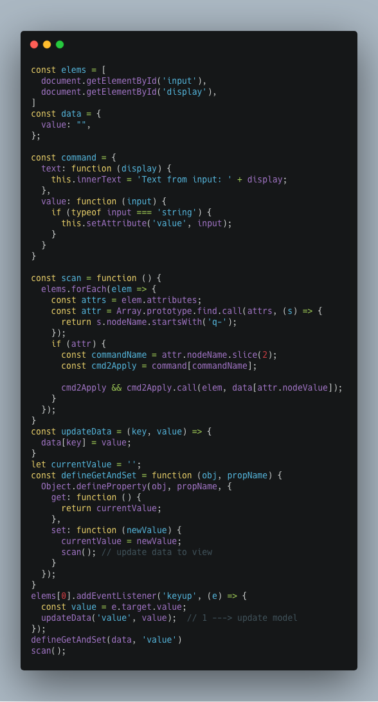

在前端的学习中，经常会听到双向绑定（`MVVM`）这个概念，双向绑定的概念很简单，就是视图（`View`）上的更新能够实时更新数据层（`Model`），同时数据层的更新也会实时更新到视图层。不同于`MVC`的数据单向流动（从数据层到视图层），那么如何实现数据和视图的双向绑定呢？
实现数据的双向绑定，首先我们要搞明白面临的问题：
- 如何监听试图层的变化？
- 视图层变化之后如何更新到数据层？
- 如何监听数据层的变化？
- 如何将数据层的变化更新到视图层？

视图层的更新主要是来自用户的输入行为（输入、点击等），我们可以通过监听事件的方式（`keyup`、`keydown`等），在事件回调中获取视图层的更新，将更新同步到数据层上，由于数据层的更新，我们再用数据去刷视图层，这样就是实现了双向绑定，从网上获取的资料来看，主要有以下几种实现方式：

# 手动绑定
这里手动绑定的意思是，在`DOM`上绑定事件回调，在事件回调函数值中去更新数据层和重新渲染视图，简单的实现如下：

如上，我们在`HTML`中有一个`input`元素用来输入，另一个`div`元素用来显示输入的元素；在这两个元素上我们声明了特定的属性`q-value`和`q-text`，这两个属性名标示着和数据层的绑定关系，如下，是相关的JS代码：

这里我们实现双向绑定的思路是，视图层对数据的绑定是通过特定的属性`q-*`，来将`UI`和`Model`绑定起来，使用事件回调监测数据的变化，更新数据，然后刷新`UI`。

# 脏检测
`AngularJS`的数据双向绑定是基于脏检查的机制，脏检查的大致实现思想是，在数据层上维护变量的当前值，当视图层上的操作引起数据更新时，会执行脏检测，如果有绑定的变量的值发生了变化，变量对应的指令就会刷新数据绑定的`UI`；同样的脏检查机制的实现，我们在`DOM`上的也有绑定两个东西，一个是数据层上的变量的应用，`UI`更新的时候更新对应的变量，然后另外就是绑定的指令，用来执行具体的`UI`层面的更新逻辑。

# 数据劫持
实现双向绑定的另一种方式是，使用数据劫持的方式，给数据层的属性定制`getter`和`setter`，在`UI`上触发了回调函数更新数据的时候，会调到我们定制的`setter`中，在`setter`中会刷新`UI`。

在`DOM`属性上我们只需要指明引用的变量，具体的`UI`刷新逻辑定义在`setter`中。

以上是实现一个双向绑定的常见手段，这里只是了解大致的原理，具体到不同的前端框架中实现的双向绑定，比文章中介绍的更复杂和更健壮，这里只是了解其原理，抓住主要实现原理，框架层面的实现也是基于这些原理来做的。
文中的[Demo Code](https://github.com/Soyn/demos/tree/master/mvvm)
# Refrence
- [javascript实现数据双向绑定的三种方式](https://jixianqianduan.com/frontend-javascript/2015/11/29/js-data-two-ways-binding.html)
- [JavaScript数据双向绑定的简单演示 - 前端知识点小结 - SegmentFault 思否](https://segmentfault.com/a/1190000004681757)
- [数据双向绑定的分析和简单实现 - 知乎](https://zhuanlan.zhihu.com/p/25464162)

---
***兴趣遍地都是，坚持和持之以恒才是稀缺的***
